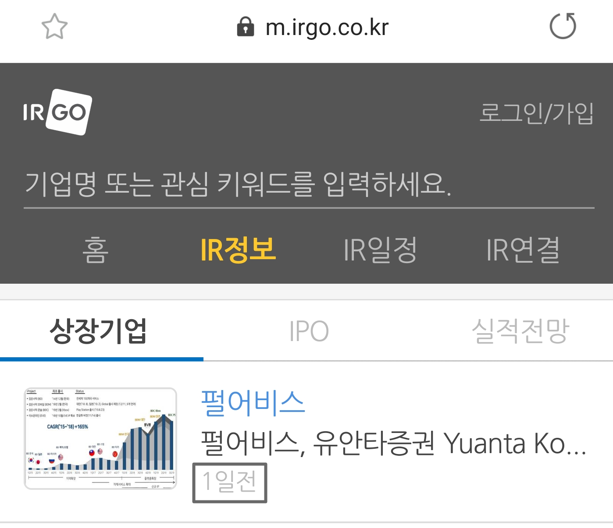
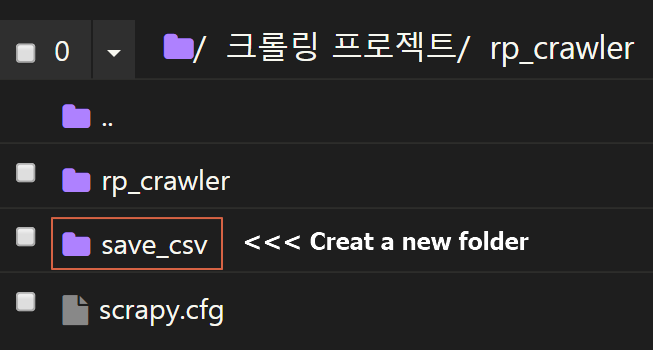
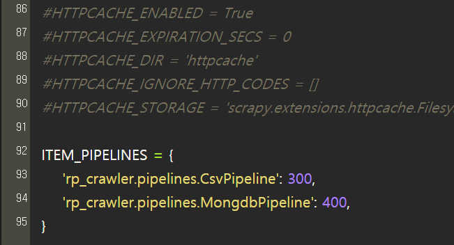

### Web crawler that collects IR reports from "https://m.irgo.co.kr/IR%EC%9E%90%EB%A3%8C"

### 1. Overview

◈ Required Packages (These packages must be installed)
1) Scrapy
2) Datetime
3) Pymongo

The crawler collects ir data from the previous day and stores it in a csv file. The data stored in csv is stored together in Mongodb for backup.

From the site above, the crawler enters the page with date "1일전" and collects data.

◈ Data collected by crawler
1) corporate name
2) date uploaded
3) link to download ir-material
4) company code

◈ Data stored in csv files
1) corporate name
2) date uploaded
3) link to download ir-material
4) link to view the company's financial statements (using company code)

### 2. How to use the jupyter_notebook file (ir_for_foreigners_edited.ipynb)

Please use "ir_for_foreigners_edited.ipynb". This is the most recent file I uploaded.

It's easy to use. Simply run the code in this file in order.

1) creat new project
2) writefile "items.py"
3) writefile "spiders.py"
4) writefile "mongodb.py" (please enter your own server address instead of ##.###.###.###)
5) writefile "pipelines.py"
6) writefile run.sh (a file that run the crawler, "run.sh" is stored in the folder where this jupiter_notebook file is located)
7) add "run.sh" file execution permissions to all users

### 3. To create a folder where csv files are stored

You must create a new folder named "save_csv" in the path "/rp_crawler". Csv files are stored in this folder.

### 4. To change "settings.py" settings

"settings.py" is located in the path "rp_crawler/rp_crawler".
Please add the following to the bottom line.

#### ITEM_PIPELINES = {'rp_crawler.pipelines.CsvPipeline': 300, 'rp_crawler.pipelines.MongdbPipeline': 400,}

### 5. Running the crawler

From the Shell, go to the folder where "run.sh" is located. And run the crawler with the command "./run.sh".

Go to the "save_csv" folder and make sure that the csv files have been saved.

## I hope you find this information useful!

## 한국어 설명

### "https://m.irgo.co.kr/IR%EC%9E%90%EB%A3%8C" 에서 IR 리포트를 수집하는 웹 크롤러입니다.

### 1. 개요

◈ 필요한 패키지 (크롤러가 실행되는 환경에 이 패키지들이 설치되어 있어야 합니다)
1) scrapy
2) datetime
3) pymongo

전일 나온 ir 데이터를 수집하고, 필요한 형태로 가공해 csv파일로 저장합니다. csv로 저장되는 데이터는 백업을 위해 mongodb에 함께 저장됩니다.

위 사이트에서 날짜가 "1일전"인 페이지에 들어간 후 데이터를 수집합니다.

◈ 수집하는 데이터
1) 기업명
2) 종목 코드
3) 자료가 올라온 날짜
4) ir 자료 다운로드 링크

◈ csv 파일로 저장하는 데이터
1) 기업명
2) 자료가 올라온 날짜
3) ir자료 다운로드 링크
4) 해당 기업 재무제표를 볼 수 있는 링크(종목 코드를 이용해 가공)

### 2. jupyter_notebook 파일 사용법 (ir_yesterday_edited.ipynb)

"ir_yesterday_edited.ipynb"를 사용하시기 바랍니다. 가장 최근에 업로드한 파일입니다. ("ir_for_foreigners.ipynb"는 외국인들을 위해 영어 설명을 첨부한 파일입니다)

사용법은 간단합니다. 이 파일에 나온 코드를 순서대로 실행시키면 됩니다.

1) 프로젝트 생성
2) "items.py" 작성
3) "spiders.py" 작성
4) "mongodb.py" 작성 ("##.###.###.###" 대신 본인 서버 주소를 입력하세요)
5) "pipelines.py" 작성
6) "run.sh" 작성 (크롤러를 실행시키는 파일입니다, "run.sh"는 이 주피터 노트북이 위치한 폴더에 저장됩니다)
7) "run.sh" 파일에 실행 권한 부여

### 3. csv 파일이 저장되는 폴더 생성

"/rp_crawler" 경로에 "save_csv" 폴더를 새로 생성해야 합니다. csv 파일은 "save_csv" 폴더에 저장됩니다.

### 4. "settings.py" 설정 변경

"settings.py"는 "rp_crawler/rp_crawler" 경로에 있습니다. "setting.py"를 실행하셔서 맨 아래줄에 아래 내용을 추가해 주세요.

#### ITEM_PIPELINES = {'rp_crawler.pipelines.CsvPipeline': 300, 'rp_crawler.pipelines.MongdbPipeline': 400,}

### 5. 크롤러 실행

쉘에서 "run.sh"가 위치한 폴더로 이동하세요. "./run.sh" 명령어로 크롤러를 실행하시면 됩니다. 크롤러가 작동이 끝나면 "save_csv" 폴더에 csv 파일이 잘 저장됐는지 확인하세요.

## 유용하게 사용하시기 바랍니다 !
